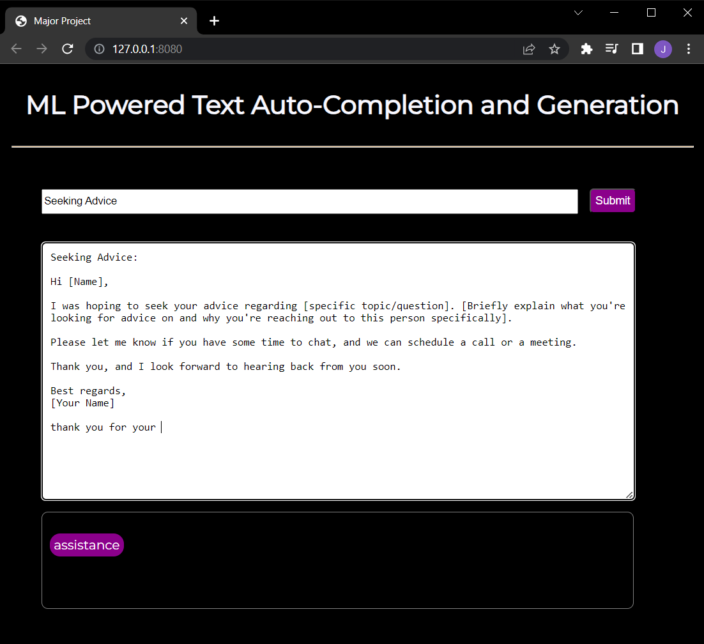

# ML Powered Text Auto-Completion and Generation

## Step by step procedure
1. Install VS Code
2. Downloading the Enron Email dataset from kaggle
3. Uploading the dataset in the project path
4. Data Preprocessing for the text dataset
5. Tokenizing the vocabulary and saving the tokenized files to pickle files
6. Converting the data to sequences of input data and sequences
7. Converting the class vector to binary class matrix
8. We then build our model using LSTM 
9. Training the model with loss function as categorical cross entropy
10. Testing the model for next word prediction
11. Dataset collection for mail templates in different categories
12. Pre-processing the email data collected
13. Training the RNN model
14. Using the RNN-GRU model for text generation
15. We have even build UI using Flask where the user can interact

## Output

